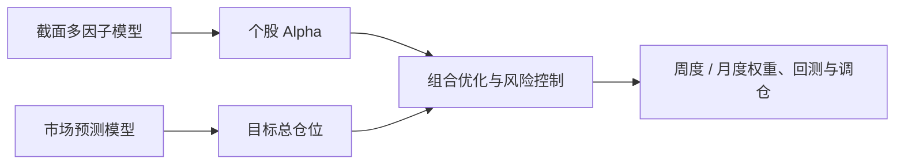

# 股票量化投资系统

本仓库用于集中展示一套面向中国 A 股市场的端到端量化投资系统。系统由截面多因子选股、市场状态与仓位预测、组合优化与风险控制三个模块组成，并按照数据在真实决策时点的可得性连接为完整投资流程。

本仓库由三个独立生产项目整理而来。生产仓库仍然独立维护，本仓库仅保存可公开、可复现的代码、配置、文档和少量示例结果，不包含完整行情、财务数据、训练缓存、模型权重或账户信息。

## 系统流程



截面模型回答“买哪些股票”，市场模型回答“账户投入多少仓位”。两条信号相互独立生成，在组合层汇合后统一处理行业集中度、个股权重、风险、换手和交易执行约束。

## 目录

- `modules/01截面选股模型`：数据处理、因子计算、严格 PIT、LightGBM 训练、融合与选股回测。
- `modules/02市场仓位模型`：市场特征、时序验证、状态预测、仓位策略与经济意义检验。
- `modules/03组合优化与风控`：日度信号同步、周度/月度组合优化、VaR 缩放、交易规则、回测和调仓输出。
- `docs`：系统架构、方法说明、PIT 与防前视设计。
- `configs`：后续提供脱敏的统一演示配置。
- `sample_data`：后续提供字段定义及少量演示数据。
- `results`：后续仅保留经过筛选的代表性结果。
- `scripts`：保留给脱敏演示入口；当前生产编排入口位于组合模块根目录。

## 设计原则

1. 所有特征均按真实可得时间对齐，避免使用决策时点尚不可见的数据。
2. 训练、验证、预测和回测保持时间顺序，避免随机切分造成的信息泄漏。
3. 个股 Alpha 与市场仓位分别建模，再由组合层统一处理约束和交易成本。
4. 上游每日发布版本化信号，下游依据官方交易日历独立形成周度和月度组合轨道。
5. 研究结果与可发布信号分离；重复发布必须通过来源和文件哈希校验。

## 完整流程

展示仓库保留与生产项目一致的 27 步编排入口，包括每周数据更新、因子计算、增量训练、发布、双频组合优化、VaR/ES、回测及调仓报告。流水线按上海时间自然周保存检查点，可从失败或中断步骤继续：

```powershell
conda activate qf_clean
python .\modules\03组合优化与风控\run_full_pipeline.py
```

```powershell
# 查看全部命令但不执行
python .\modules\03组合优化与风控\run_full_pipeline.py --dry-run

# 无交互地继续本周未完成步骤
python .\modules\03组合优化与风控\run_full_pipeline.py --resume
```

完整运行需要用户自行准备合法取得的数据和数据源令牌。本仓库不包含生产数据、训练缓存、模型文件、发布信号或账户信息。

## 历史回测结果

| 模块 | 总收益 | 年化收益 | 夏普比率 | 最大回撤 |
| --- | ---: | ---: | ---: | ---: |
| 严格 PIT 截面选股 | 40.13% | 12.94% | 0.39 | -34.49% |
| Ridge 市场仓位 90/45/0 | 82.42% | 24.39% | 1.65 | -16.88% |
| 严格 PIT 完整组合 | 46.33% | 14.82% | 1.22 | -18.07% |

### 严格 PIT 截面选股


### Ridge 市场仓位策略


### 严格 PIT 完整投资组合


市场仓位结果使用指数代理检验择时信号的经济意义，并非包含个股选择和真实组合约束的股票回测。完整口径、样本区间及可比性说明见[结果摘要](./results/README.md)。历史结果不代表未来收益，也不构成投资建议。

## 当前状态

三个生产模块的公开源码快照、周度/月度数据契约和端到端编排入口已经同步。仓库同时保留精选绩效图和结果摘要；后续仅需补充不依赖商业数据源的最小演示数据。

## 环境

当前研究环境基于 Python 3.10。核心依赖见 `requirements.txt`；仅运行 CNN-GRU 市场时序模型时再安装 `requirements-optional.txt`。

```powershell
python -m pip install -r requirements.txt
```

完整生产流程依赖合法取得的 A 股行情和财务数据。仓库不会附带数据供应商令牌，示例数据完成前请先阅读各模块 README 了解原始入口和数据契约。
