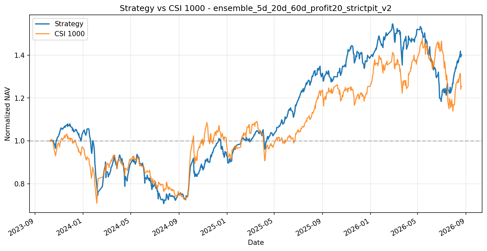
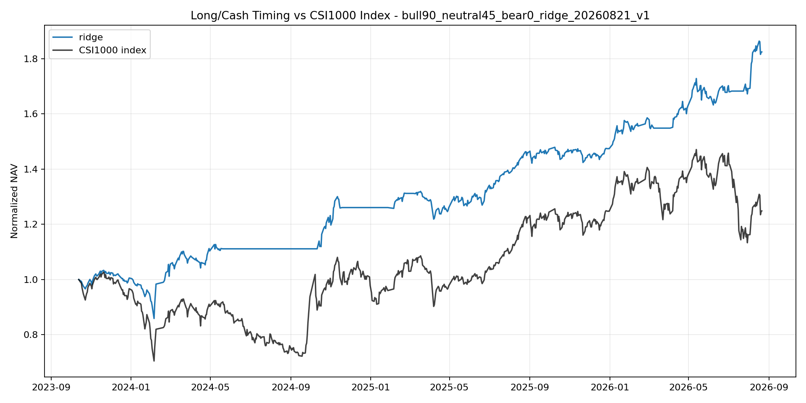
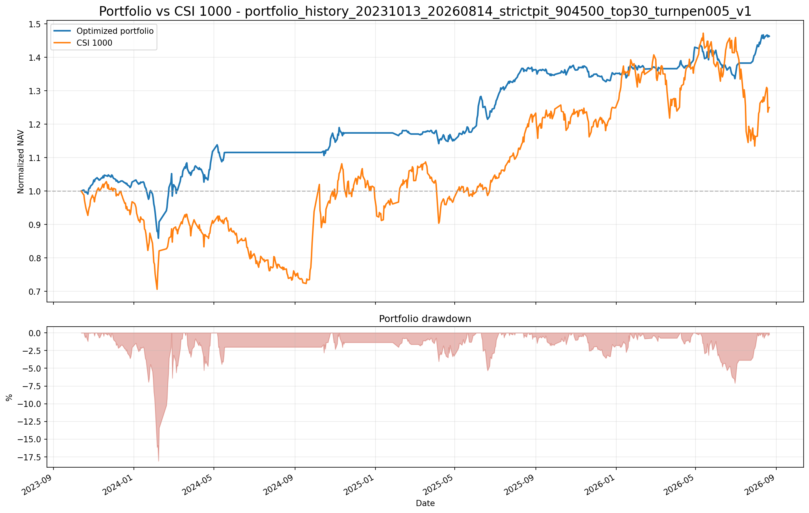

# 股票量化投资系统

本仓库用于集中展示一套面向中国 A 股市场的端到端量化投资系统。系统由截面多因子选股、市场状态与仓位预测、组合优化与风险控制三个模块组成，并通过严格的时点数据（Point-in-Time，PIT）约束连接为完整投资流程。

本仓库由三个独立生产项目整理而来。生产仓库仍然独立维护，本仓库仅保存可公开、可复现的代码、配置、文档和少量示例结果，不包含完整行情、财务数据、训练缓存、模型权重或账户信息。

## 系统流程

```text
市场与财务数据
      │
      ▼
截面多因子模型 ──► 个股预期收益与排序
      │
      ├──────────────┐
      ▼              ▼
市场预测模型 ──► 目标总仓位
                     │
                     ▼
            组合优化与风险控制
                     │
                     ▼
              回测、调仓与发布
```

## 目录

- `modules/01截面选股模型`：数据处理、因子计算、严格 PIT、LightGBM 训练、融合与选股回测。
- `modules/02市场仓位模型`：市场特征、时序验证、状态预测、仓位策略与经济意义检验。
- `modules/03组合优化与风控`：信号同步、组合优化、行业与个股约束、交易规则、回测和调仓输出。
- `docs`：系统架构、方法说明、PIT 与防前视设计。
- `configs`：后续提供脱敏的统一演示配置。
- `sample_data`：后续提供字段定义及少量演示数据。
- `results`：后续仅保留经过筛选的代表性结果。
- `scripts`：后续提供全流程检查及演示入口。

## 设计原则

1. 所有特征均按真实可得时间对齐，避免使用决策时点尚不可见的数据。
2. 训练、验证、预测和回测保持时间顺序，避免随机切分造成的信息泄漏。
3. 个股 Alpha 与市场仓位分别建模，再由组合层统一处理约束和交易成本。
4. 研究结果与可发布信号分离，模型、策略和组合输出均采用版本化标识。

## 历史回测结果

| 模块 | 总收益 | 年化收益 | 夏普比率 | 最大回撤 |
| --- | ---: | ---: | ---: | ---: |
| 严格 PIT 截面选股 | 40.13% | 12.94% | 0.39 | -34.49% |
| Ridge 市场仓位 90/45/0 | 82.42% | 24.39% | 1.65 | -16.88% |
| 严格 PIT 完整组合 | 46.33% | 14.82% | 1.22 | -18.07% |

### 严格 PIT 截面选股



### Ridge 市场仓位策略



### 严格 PIT 完整投资组合



市场仓位结果使用指数代理检验择时信号的经济意义，并非包含个股选择和真实组合约束的股票回测。完整口径、样本区间及可比性说明见[结果摘要](./results/README.md)。历史结果不代表未来收益，也不构成投资建议。

## 当前状态

第一阶段代码整理已经完成，并加入了三个模块的精选绩效图和结果摘要。下一阶段将补充最小演示数据、统一数据契约及端到端运行入口。

## 环境

当前研究环境基于 Python 3.10。核心依赖见 `requirements.txt`；仅运行 CNN-GRU 市场时序模型时再安装 `requirements-optional.txt`。

```powershell
python -m pip install -r requirements.txt
```

完整生产流程依赖合法取得的 A 股行情和财务数据。仓库不会附带数据供应商令牌，示例数据完成前请先阅读各模块 README 了解原始入口和数据契约。
