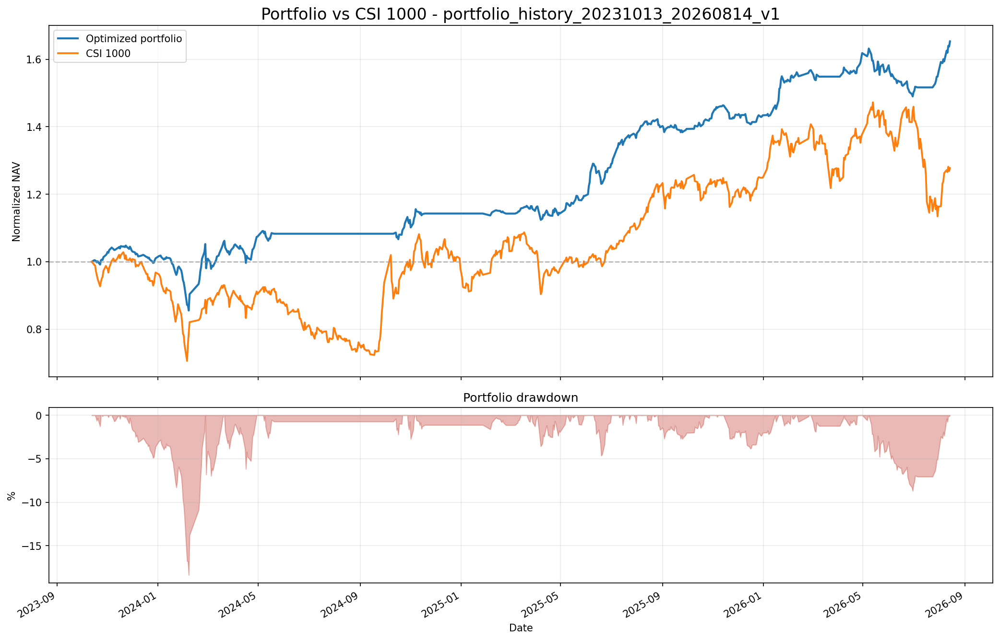

# 组合优化与风险控制系统

连接截面 Alpha、市场仓位预测、组合优化、风险测量、历史回测和调仓输出的一体化研究系统。

本项目回答三个问题：

- 截面模型决定“买什么”；
- 市场模型决定“股票总体买多少”；
- 本项目决定“每只股票买多少、组合风险多大、下一期如何调仓”。

> 当前代码契约：上游发布每日市场信号，01 层形成每日决策历史；02～05 层再按官方交易日历独立生成周度和月度轨道。VaR 缩放默认启用，周度和月度分别使用各自的风险期限与预算。

## 系统架构

```text
截面多因子模型 ── Alpha、排名 ─┐
                                ├─→ 01 组合决策输入层
市场预测模型 ── 市场状态、仓位 ─┘          │
                                           ├─ Alpha 效用
全量行情、交易状态、行业信息 ──────────────┤─ 收缩协方差
                                           └─ 可交易股票池
                                                    │
                                                    ▼
                                           02 组合优化层
                                                    │
                                                    ▼
                                           03 组合风控层
                                                    │
                                                    ▼
                                           04 组合回测层
                                                    │
                                                    ▼
                                           05 调仓输出层
```

项目采用分层发布方式。上游模型和各层之间通过版本化 Parquet 文件连接，训练过程与组合决策过程保持解耦。

## 目录结构

```text
组合风控层/
├─ 01组合决策输入层/       # 同步上游数据，生成 Alpha、股票池和协方差
├─ 02组合优化层/           # 使用 Alpha 与协方差优化股票权重
├─ 03组合风控层/           # 计算周度 5 日、月度 20 日 VaR/ES 与可选缩放
├─ 04组合回测层/           # Backtrader 周度或月度账户回测
├─ 05调仓输出层/           # 按指定频率比较最近两期权重，生成调仓报告
├─ assets/                 # README 使用的稳定图片资源
└─ README.md
```

## 各层职责

### 01 组合决策输入层

本层读取截面模型、市场模型及全量行情，遍历两个模型共有的全部日度 `signal_date`。

每一期执行：

1. 只使用信号日及以前可获得的数据；
2. 限定主板股票，过滤 ST、停牌及历史数据不足股票；
3. 在可交易股票中重新计算 `eligible_alpha_rank`，选择前 30 只；
4. 将排名转换为横截面正态分数 `alpha_zscore`；
5. 使用过去 252 个收益观测估计 Ledoit-Wolf 收缩协方差；
6. 将协方差转换成 20 日预测口径；
7. 发布日度完整历史决策输入，由下游选择周末或月末。

正式输出：

```text
outputs/releases/decision_history_起始日_结束日_v1/
├─ decision_inputs.parquet
├─ covariance.parquet
├─ period_summary.parquet
├─ config.yaml
└─ manifest.json
```

### 02 组合优化层

本层分别按周度和月度日期顺序求解每期 Top 30 股票权重；两个轨道各自使用本频率上一期目标权重计算换手惩罚。

第一版目标函数为：

```text
最小化 = 风险权重 × 标准化组合方差 - Alpha权重 × 标准化Alpha效用
```

当前主要参数和约束：

- 风险权重：`1.0`；
- Alpha 权重：`0.10`；
- 只做多；
- 市场模型仓位作为股票总仓位目标上限；
- 单只股票最高占账户 10%；
- 单一行业最高占账户 25%；
- Top 30 过度集中导致目标不可行时，不能部署的部分自动留在现金；
- 求解器：SLSQP。

优化器内部保留归一化股票权重，并发布账户实际权重：

```text
stock_exposure = min(market_target_exposure, maximum_feasible_exposure)
target_weight = base_weight × stock_exposure
cash_weight = 1 - stock_exposure
```

当前市场目标仓位为 `0% / 45% / 90%` 三档；风险约束只会向下缩仓，不会超过市场目标。

### 03 组合风控层

本层读取账户实际股票权重和同一期协方差，分别计算周度 5 日与月度 20 日风险。

第一版采用参数正态法，输出：

- 5 日组合预测波动率；
- 95% VaR 与 ES；
- 99% VaR 与 ES。

组合预测波动率为：

$$
\sigma_p=\sqrt{w^\top\Sigma w}
$$

VaR 预算缩放按 `min(1, budget / VaR)` 降低股票总仓位，并把差额留在现金；不会增加仓位，也不会改变股票相对权重。该功能默认启用。现金收益率和波动率暂设为 0，组合预期收益暂设为 0。

### 04 组合回测层

本层使用 Backtrader 对完整历史权重进行账户级回测。

当前回测规则：

- 初始资金：100,000 元；
- 行情：等比前复权；
- 信号：所选调仓频率的最后一个交易日收盘后形成；
- 执行：下一交易日开盘；
- 交易单位：100 股整数倍；
- 默认过滤同一市场仓位档位下不足账户净值 0.5% 的存量股票小额加减仓，建仓、清仓和仓位档位切换不受影响；
- 买入综合成本：0.30%；
- 卖出综合成本：0.40%；
- 每笔最低费用：5 元；
- 停牌或缺少开盘价时阻塞委托；
- 不模拟止损和涨跌停成交限制；
- 基准：中证1000（000852.SH）。

### 05 调仓输出层

本层自动读取指定周度或月度轨道的组合优化与风险版本，比较最近两期缩放后目标权重并输出：

- 上期与本期股票仓位、现金仓位；
- 卖出股票；
- 继续持有并加仓、减仓或权重不变的股票；
- 新买入股票；
- 股票代码、名称、行业、两期排名和权重变化。
- 默认按 0.5% 最小调仓阈值过滤同仓位档位下的存量股票小额变化，同时保留模型目标权重与理论执行权重供核对。

当前报告是理论调仓清单。由于尚未接入真实券商账户，阈值判断使用相邻两期目标权重近似；真实执行仍应按账户开盘实际权重判断，且不输出虚构的成交价格和实际买卖股数。

## 快速开始

### 环境与上游目录

项目当前使用 `qf_clean` Python 环境。主要依赖包括 pandas、NumPy、SciPy、scikit-learn、PyArrow、PyYAML、Backtrader、Matplotlib 和 pytest。

默认目录关系为：

```text
modules/
├─ 01截面选股模型/
├─ 02市场仓位模型/
└─ 03组合优化与风控/
```

### 完整运行顺序

日常更新可以在“投资系统”根目录一条命令完成。总入口只负责依次调用三个项目已有的入口；任一阶段失败都会立即停止：

```powershell
conda activate qf_clean
python .\modules\03组合优化与风控\run_full_pipeline.py
```

正式运行前如需检查将要执行的全部命令：

```powershell
python .\modules\03组合优化与风控\run_full_pipeline.py --dry-run
```

默认数据阶段是每周增量更新，不会重新下载全部历史。每次运行使用新的版本号发布 Alpha、市场信号、组合权重、风险和调仓报告。

流水线按照上海时间的自然周保存检查点。每个步骤成功后立即记录；同一周再次运行时，可以选择从第一个未完成步骤继续、从第1步重新运行或退出。进入下一自然周后会自动创建新的检查点，不会复用上周记录。日志保存在本地 `pipeline_logs/YYYY-Www/current.json`，不会提交到 Git。

无需交互、直接继续本周任务：

```powershell
python .\modules\03组合优化与风控\run_full_pipeline.py --resume
```

无需交互、归档本周旧记录并从第1步重跑：

```powershell
python .\modules\03组合优化与风控\run_full_pipeline.py --restart
```

如需单独维护某一层，可进入 `modules/03组合优化与风控` 后依次运行：

```powershell
# 1. 同步上游数据并重建全部历史决策输入
python .\01组合决策输入层\run_pipeline.py

# 2. 生成全部历史优化权重
python .\02组合优化层\optimize.py --frequency both

# 3. 生成全部历史 5 日 VaR/ES
python .\03组合风控层\assess_risk.py --frequency both

# 4. 运行 Backtrader 回测
python .\04组合回测层\backtrader.eval.py --frequency weekly
python .\04组合回测层\backtrader.eval.py --frequency monthly

# 5. 生成最近两期调仓报告
python .\05调仓输出层\generate_rebalance_report.py --frequency weekly
python .\05调仓输出层\generate_rebalance_report.py --frequency monthly
```

同名回测或调仓报告已经存在时，明确添加 `--overwrite`：

```powershell
python .\04组合回测层\backtrader.eval.py --overwrite
python .\05调仓输出层\generate_rebalance_report.py --overwrite
```

## 当前历史数据规模

| 数据集 | 规模 |
|---|---:|
| 周度信号 | 148 期 |
| 信号区间 | 2023-10-13 ～ 2026-08-21 |
| 每期候选股票 | 30 只 |
| 决策输入 | 4,440 行 |
| 协方差长表 | 133,200 行 |
| 优化权重 | 4,440 行 |
| 组合风险记录 | 148 行 |

## 当前严格 PIT 回测结果

以下结果来自：

```text
portfolio_history_20231013_20260814_strictpit_904500_top30_turnpen005_minreb005_v1
```

| 指标 | 优化组合 | 中证1000 |
|---|---:|---:|
| 累计收益率 | 46.33% | 24.99% |
| 年化收益率 | 14.82% | 8.44% |
| 年化波动率 | 11.95% | 27.98% |
| 夏普比率 | 1.22 | 0.43 |
| 最大回撤 | -18.07% | -31.35% |

其他账户结果：期末资金 146,329.53 元，成交 1,478 次，总交易成本 25,219.14 元。该版本启用 0.05 换手惩罚与 0.5% 最小调仓阈值。

## 历史旧基线回测结果

以下结果来自：

```text
portfolio_history_20231013_20260814_v1_high_cost
```

| 指标 | 优化组合 | 中证1000 |
|---|---:|---:|
| 累计收益率 | 65.31% | 27.75% |
| 年化收益率 | 20.18% | 9.37% |
| 年化波动率 | 12.36% | 27.84% |
| 夏普比率 | 1.55 | 0.46 |
| 最大回撤 | -18.37% | -31.35% |

其他账户结果：

- 期末资金：165,314.87 元；
- 成交次数：1,712 次；
- 总交易成本：27,775.75 元；
- 最后一期 `2026-08-21` 的计划执行日为 `2026-08-24`；在8月24日行情产生前，不假设成交结果。



> 回测结果用于验证研究链路，不构成实盘收益承诺。当前股票仓位包含市场模型的三档择时，因此净值曲线中的长水平区间表示空仓或低仓位阶段，并非数据缺失。

## 测试

全部层级测试可以在项目根目录一次运行：

```powershell
python -m pytest -q
```

## 数据与 Git

以下内容默认不提交到 Git：

- 同步的全量行情和上游模型输出；
- 各层 `outputs/` 正式发布文件；
- 回测和调仓 `reports/`；
- Python 缓存与 pytest 缓存。

README 使用的稳定图片单独保存在 `assets/` 中，便于在 GitHub、GitLab 或其他云端仓库直接展示。

## 当前限制与下一步

- Alpha 当前是横截面效用分数，不是经过历史 IC 校准的绝对收益率预测；
- 市场仓位采用 `0% / 45% / 90%` 三档目标上限，极端行业集中时组合层会增加现金；
- 默认优化配置启用 0.05 的换手惩罚，实际交易成本仍在回测层扣除；
- VaR/ES 使用参数正态假设，尚未加入历史模拟、压力测试和尾部相关结构；
- 回测尚未模拟涨跌停不可成交；
- 调仓输出尚未接入真实账户持仓和券商执行结果。

后续参数或模型只有经过严格的滚动样本外对照回测后，才应替换当前基线。
